[Good Listener Report](./path/to/your/file.html)

<html><head><meta content="text/html; charset=UTF-8" http-equiv="content-type"></head><body class="c12 c47 doc-content">

Good Listener

ECE 420&nbsp;Final Report

Ritvik Avancha and WonJoon Lee

Table of Contents

<a class="c10" href="#h.rrzs0l2q2t1">1. Introduction</a>&nbsp;&nbsp;&nbsp;&nbsp;&nbsp;&nbsp;&nbsp;&nbsp;<a class="c10" href="#h.rrzs0l2q2t1">2</a>

<a class="c10" href="#h.cdpkhdfs3ii">2. Background and Literature Review</a>&nbsp;&nbsp;&nbsp;&nbsp;&nbsp;&nbsp;&nbsp;&nbsp;<a class="c10" href="#h.cdpkhdfs3ii">3</a>

<a class="c10" href="#h.ygnpcb147i8d">3. Technical Presentation</a>&nbsp;&nbsp;&nbsp;&nbsp;&nbsp;&nbsp;&nbsp;&nbsp;<a class="c10" href="#h.ygnpcb147i8d">5</a>

<a class="c10" href="#h.oo1q9ofwtxqw">3.1 Live Recording</a>&nbsp;&nbsp;&nbsp;&nbsp;&nbsp;&nbsp;&nbsp;&nbsp;<a class="c10" href="#h.oo1q9ofwtxqw">6</a>

<a class="c10" href="#h.r8mzpuwuwe8g">3.2 Modified Mel Frequency Cepstral Coefficient (MFCC) Feature Extraction</a>&nbsp;&nbsp;&nbsp;&nbsp;&nbsp;&nbsp;&nbsp;&nbsp;<a class="c10" href="#h.r8mzpuwuwe8g">6</a>

<a class="c10" href="#h.nd5gxin54er8">3.3 &nbsp;KMean based Speaker Modeling</a>&nbsp;&nbsp;&nbsp;&nbsp;&nbsp;&nbsp;&nbsp;&nbsp;<a class="c10" href="#h.nd5gxin54er8">9</a>

<a class="c10" href="#h.nzzxt8u526mn">4. Results</a>&nbsp;&nbsp;&nbsp;&nbsp;&nbsp;&nbsp;&nbsp;&nbsp;<a class="c10" href="#h.nzzxt8u526mn">11</a>

<a class="c10" href="#h.1acqp6dkj4a3">4.1 Python Result</a>&nbsp;&nbsp;&nbsp;&nbsp;&nbsp;&nbsp;&nbsp;&nbsp;<a class="c10" href="#h.1acqp6dkj4a3">11</a>

<a class="c10" href="#h.ezm7o3vumad3">4.2 Android Result</a>&nbsp;&nbsp;&nbsp;&nbsp;&nbsp;&nbsp;&nbsp;&nbsp;<a class="c10" href="#h.ezm7o3vumad3">13</a>

<a class="c10" href="#h.4s8ojyt4hh3r">5. Conclusion</a>&nbsp;&nbsp;&nbsp;&nbsp;&nbsp;&nbsp;&nbsp;&nbsp;<a class="c10" href="#h.4s8ojyt4hh3r">16</a>

<a class="c10" href="#h.llg3jqx7hkza">5.1 &nbsp;Errata</a>&nbsp;&nbsp;&nbsp;&nbsp;&nbsp;&nbsp;&nbsp;&nbsp;<a class="c10" href="#h.llg3jqx7hkza">16</a>

<a class="c10" href="#h.ahs3h2vyiel2">5.2 Suggestions</a>&nbsp;&nbsp;&nbsp;&nbsp;&nbsp;&nbsp;&nbsp;&nbsp;<a class="c10" href="#h.ahs3h2vyiel2">17</a>

<a class="c10" href="#h.dwjfy6ex0q9o">References:</a>&nbsp;&nbsp;&nbsp;&nbsp;&nbsp;&nbsp;&nbsp;&nbsp;<a class="c10" href="#h.dwjfy6ex0q9o">20</a>

<a class="c10" href="#h.nr0qrrm854x4">Appendix A: Software Documentation</a>&nbsp;&nbsp;&nbsp;&nbsp;&nbsp;&nbsp;&nbsp;&nbsp;<a class="c10" href="#h.nr0qrrm854x4">22</a>

<h1 class="c4 c22" id="h.1m7vi36srono"></h1><h1 class="c4 c22" id="h.v5uqxdhbnpje"></h1>

<h1 class="c4" id="h.eyzljbjh2po">1. Introduction&nbsp;</h1>
With the fast networking speed and the advancement of artificial intelligence, the internet of things (IoT) is easily accessible in daily life. Some popular examples include smart speakers like Amazon Echo and Google Home. These devices interface with internet connections and allow voice communication and controls for practically everything that we do in our daily routines. From setting daily alarms to even monitoring who is in front of the front door, these voice-controlled devices are already deeply integrated into our everyday lives.&nbsp;

With more biometric information being incorporated into our daily technology, a security system that can complement such systems is needed. Therefore,&nbsp;whether it is for voice-controlled devices or daily technology,&nbsp;voice recognition can be a useful technique for the privacy of information. Inspired by this, we propose a voice-recognition widget that can be implemented easily on the mobile and IoT devices
<h1 class="c4 c22" id="h.mn5cef537tda"></h1>

<h1 class="c4 c22" id="h.587wtpfikmlr"></h1><h1 class="c4" id="h.cdpkhdfs3ii">2.&nbsp;Background and Literature Review</h1>
&nbsp;&nbsp;&nbsp;&nbsp;&nbsp;&nbsp;&nbsp;&nbsp;After doing research on speaker verification and identification applications, there are many approaches for such solutions. Largely, the types of problems are defined by text-dependent vs. text-independent. Text-dependent focuses on identifying if specific words or short sounds were spoken by the target (speaker). Text-independent issues are more complicated since this focuses on identifying a speaker regardless of specific speech[1]. 

Voice recognition processes typically are composed of two steps: feature extraction and recognition. The feature extraction step tries to analyze the trait of the voice signal. Because human speech is an analog signal, to process this digitally, some analog to digital conversion is needed. Also, to actually be able to analyze the converted digital signal, the voice signal needs to be processed so that human speech characteristics are reflected and characterized uniquely. Without this step, classification steps are meaningless. For any type of human speech characterization in DSP, Mel Frequency Cepstrum Coefficient (MFCC) is the standard algorithm implemented. 

The classification step is the state-of-art process where various methods and implementations exist. In the IEEE&nbsp;&quot;Speaker Recognition by Machines and Humans: A tutorial review&quot;&nbsp;paper, many variations of the Gaussian Mixture Model (GMM) are introduced for the classification step[1]. GMM is a method that combines multiple Gaussian Probability Density Functions (PDF) and computes the similarity between the known data and the unknown (in our application, speaker) data[2].&nbsp;Some other variations of GMM include UBM (GMM-UBM Verification System), where GMM is trained to represent the speaker-independent distribution of the speech feature for a large sample of speakers[1]. 

&nbsp;

(For M gaussian components, = weight of gth mixture component, = random vector, = mean vector, = covariance matrix)

Equation 1. Probability Density Function of GMM [2]

Other variations use supervectors that concatenate the mean vectors of multiple GMMs to compare the utterances of different lengths[1], which is useful for generalized classification applications. More robust algorithms also utilize Factor Analysis (FA) or Support Vector Machine (SVM) for further accuracy of the classification. 

Since our application is restricted to specific command words or passcode, it is a text-dependent problem. Also, after the python implementation, there has been a recommendation to pivot the classification to the gender application given the scope of the class and the time given. For the feature extraction step, Mel Frequency Cepstrum Coefficient (MFCC) implementation carried over from the python implementation. This is the standard robust algorithm used as a standard for many human speech analysis so no modification was needed. However, standard GMM and its variations seemed too much of an overkill for our application. Based on the research paper and application notes describing the gender specific voice recognition, K-Means clustering was implemented to classify male and female voices[3]. 

<h1 class="c4" id="h.ygnpcb147i8d">3. Technical Presentation </h1>
&nbsp;&nbsp;&nbsp;&nbsp;&nbsp;&nbsp;&nbsp;&nbsp;A general overview of the system flow is represented in Figure 1. Compared to the Python implementation, the Android implementation needs to be able to take in the input from the live speaker. Therefore, an extra &ldquo;Live Recording&rdquo; feature has been added. 

&nbsp;&nbsp;&nbsp;&nbsp;&nbsp;&nbsp;&nbsp;&nbsp;In addition to the Live Recording, some modifications had to be made prior to the MFCC feature extraction due to the PCM decoding format that Android packs audio signal. Other than these pre-processing steps, most of the feature extraction and classification algorithms remain the same as the python implementation due to the promising result from the assigned project lab. 

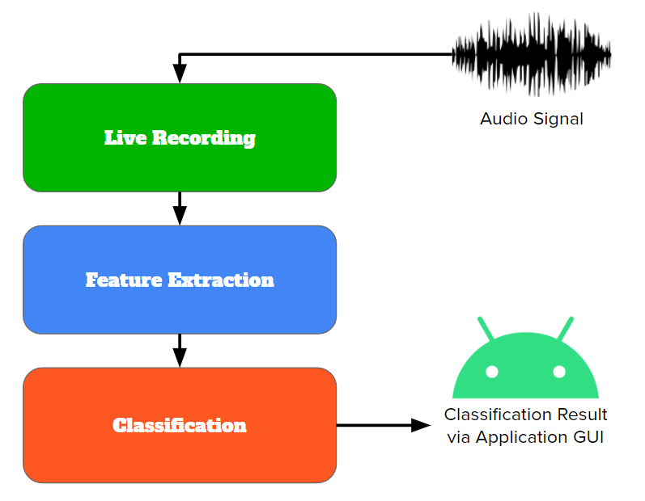

Figure 1: High-Level Block Diagram of the Application

<h2 class="c4" id="h.oo1q9ofwtxqw">3.1 Live Recording </h2>
&nbsp;&nbsp;&nbsp;&nbsp;&nbsp;&nbsp;&nbsp;&nbsp;To make the application real-time, live recording functionality was implemented. Compared to the python implementation, the goal of the Android application is not to load sample .wav files and analyze the pre-recorded signal. It needs to take in the user&rsquo;s voice with the device microphone whenever the user desires to. 

&nbsp;&nbsp;&nbsp;&nbsp;&nbsp;&nbsp;&nbsp;&nbsp;The recording functionality was implemented using the Android studio&rsquo;s built-in Recorder API. This easily enables the application to select the input device (built-in microphone of the tablet) and integrate start and stop functionalities as well.&nbsp;

&nbsp;&nbsp;&nbsp;&nbsp;&nbsp;&nbsp;&nbsp;&nbsp;However, it is hard to output live analysis data of the ongoing input stream because the voice features must be analyzed in a quasi-stationary manner to output meaningful digital characteristics[4]. Therefore, our live recording implementation has a start and stop button to distinctly divide the input sampling process and voice recognition process. Only after the stop button is pressed (or recording automatically stops due to the audio buffer being 100% full), the program moves on to the MFCC and KMeans. This was simply done by setting a flag on our processing frame.
<h2 class="c4" id="h.r8mzpuwuwe8g">3.2 Modified Mel Frequency Cepstral Coefficient (MFCC) Feature Extraction</h2>
&nbsp;&nbsp;&nbsp;&nbsp;&nbsp;&nbsp;&nbsp;&nbsp;The MFCC approach has the advantage of being able to identify characteristics of short energy (short speech) on a frequency scale. The algorithm will take in the speech signal and first sample into frames and will be multiplied by the hamming window. After the spectrum level analysis, FFT will be computed on this processed discrete signal. Finally, the resulting signal will be logged and IFFT (or DCT) will be computed to produce the cepstrum coefficients.

Prior to doing any traditional MFCC process, because Android uses PCM-16 decoding to process the audio data, PCM-16 decoding had to be done. As done in lab 2, little endian byte order had to be decoded and put into the output buffer. Because of this particular decoding process, the MFCC framing structure had to be modified. This design choice was made due to PCM-16 decoding putting its output data in the format of the buffer memory. Instead of going through the buffer and framing the input data, our implementation directly stores the decoded data in the frame. This way, memory efficiency was able to be saved and the flow of the program was much more concise and straightforward. The framing process itself does not change however. Because the decoded audio signal still needs to be processed with overlapping frames, frame size of 20ms and 10ms of overlap was used. This choice of frame size is different compared to python&rsquo;s 25ms size and is further explained in section 5.1. In addition, every frame is now multiplied with the Hamming window to smooth out the edges and reduce the distortion while taking the FFT. Any type of pre-processing such as pre-emphasis (to smooth out the higher frequency amplitude) or voice detection has been implemented with this step. 

After framing and windowing, FFT is computed and data is converted to the frequency domain. For the FFT operation, Kiss FFT library used in the previous labs is used. The frequency domain data is squared to obtain the power spectrum. The power spectrum now is converted to &ldquo;Mel scale&rdquo;, which is &ldquo;human perception of the frequency content of sounds that follow a subjectively defined nonlinear scale&rdquo;[1], using the Equation 2. &nbsp;&nbsp;

&nbsp;&nbsp;&nbsp;&nbsp;&nbsp;&nbsp;&nbsp;&nbsp;&nbsp;= 1125*ln(1+ 

Equation 2. Relationship between Mel Scale and Frequency (Hz)

&nbsp;&nbsp;&nbsp;&nbsp;&nbsp;&nbsp;&nbsp;&nbsp;Mel spectrum conversion is not complete without applying the mel filter banks. Mel filter banks are a type of bandpass filter with the shape of a triangle. Without this filter, center frequencies are relatively evenly spaced out throughout the axis. However, human ear perception picks up sound in a non-linear way and the mel filter banks help model this using Equation 3[4].

&nbsp;

m = Index of output band ranging from 0 to M-1

M = Design choice of total filter number

k = Index of energy spectrum bin

f = Frequency spectrum 

Equation 3. Mel Filter Bank Equation[4]

After the frequency spectrum is converted to mel scale (with design choice coefficients or filter bank numbers), the response needs to be converted to a logarithmic&nbsp;scale. Finally, discrete cosine transform (DCT) will be taken on the logarithmic response. On the android implementation, a pre-implemented function of DCT was imported from the external source[5]. &nbsp;&nbsp;

Finally, to choose the 12 mel cepstral coefficients are outputted instead of the common number of 13. This is because the first index of each frame and the first frame is discarded due to constant outlier occurrences. However, for most of MFCC implementation, 8 to 13 coefficients are recommended, therefore, using 12 coefficients should not be the source of any problems[4]. 

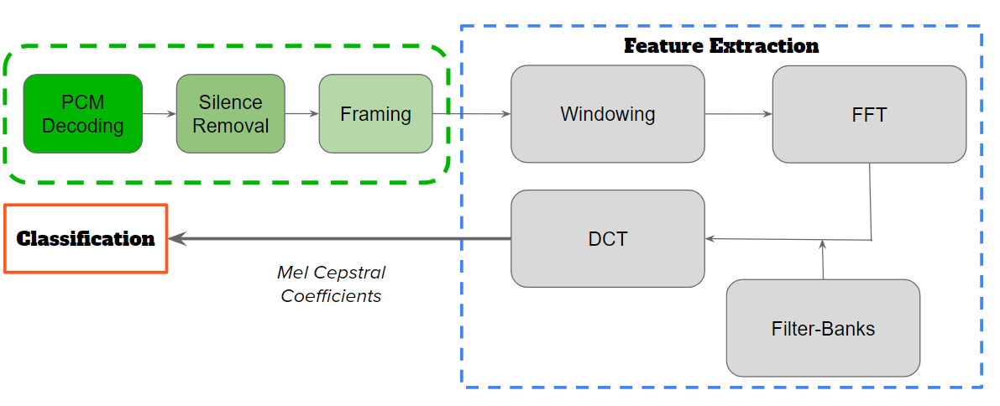

Figure 2: Android Feature Extraction with MFCC

<h2 class="c4" id="h.nd5gxin54er8">3.3 &nbsp;KMean based Speaker Modeling</h2>
&nbsp;&nbsp;&nbsp;&nbsp;&nbsp;&nbsp;&nbsp;&nbsp;Classifying the feature vectors extracted from the audio file is the second part of our proposed model. Our model proposes we use the KMeans algorithm to classify our data. The KMeans training algorithm functions by first randomly selecting K centroids, 3 in our case. Then the algorithm dictates we classify the given data into K clusters by picking the centroid with the minimum distance. Once all the data is clustered into K sets, the algorithm dictates calculating new centroids from the clustered data. The second and third steps are repeated until the centroids converge or the maximum number of iterations is reached. 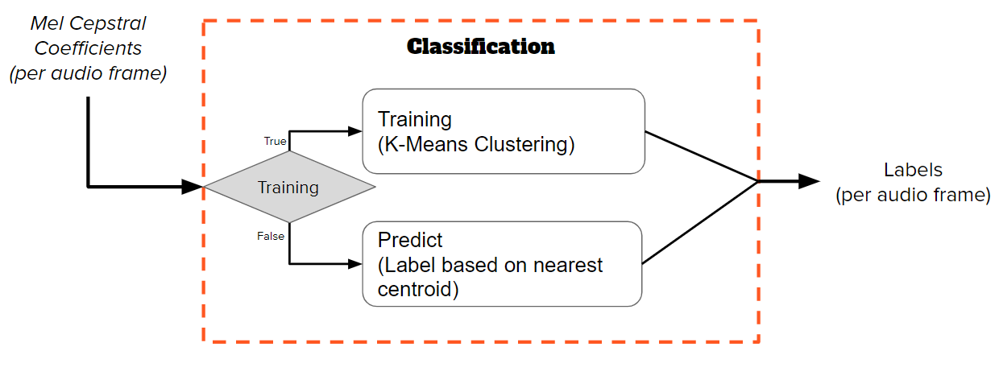

Figure 3: Classification using KMeans

&nbsp;&nbsp;&nbsp;&nbsp;&nbsp;&nbsp;&nbsp;&nbsp;
<table class="c39"><tr class="c8"><td class="c36" colspan="1" rowspan="1">
K-Means Pseudo Code:

1.&nbsp;Choose the&nbsp;number&nbsp;of&nbsp;clusters, k, &nbsp;and&nbsp;obtain the&nbsp;data points  2.&nbsp;Initialize the&nbsp;centroids with&nbsp;random&nbsp;data points 3.&nbsp;for&nbsp;each&nbsp;data point x_i:  &nbsp; &nbsp; &nbsp; a. find the&nbsp;nearest centroid(c_1, c_2 .. c_k   &nbsp; &nbsp; &nbsp; b. assign the&nbsp;point to&nbsp;that cluster  4.&nbsp;for&nbsp;each&nbsp;cluster j = 1..k  &nbsp; &nbsp; &nbsp; a. new&nbsp;centroid = mean of&nbsp;all points assigned to&nbsp;that cluster 5.&nbsp;Repeat steps 3&nbsp;and&nbsp;4&nbsp;until&nbsp;the&nbsp;centroids converge or&nbsp;until&nbsp;we hit the&nbsp;iteration limit 
</td></tr></table>

<h1 class="c4" id="h.nzzxt8u526mn">4. Results </h1><h2 class="c4" id="h.1acqp6dkj4a3">4.1 Python Result</h2>
&nbsp;&nbsp;&nbsp;&nbsp;&nbsp;&nbsp;&nbsp;&nbsp;Before we dive into the results of the Android implementation, let&#39;s revisit the python results. In section 4.2 Android Result, this python section results are referenced multiple times to juxtapose the results and analyze the discrepancies. 

&nbsp;&nbsp;&nbsp;&nbsp;&nbsp;&nbsp;&nbsp;&nbsp;In the python, speaker identification worked best when the given speakers were distinctly opposite gendered. Using audio samples from the internet, we obtained audio of both speakers saying the word &ldquo;hello&rdquo; with very distinct voices. Figure 4 illustrates the clear cut distinctions between the three clusters. This clear cut distinction allows for classification using KMeans with high accuracy as illustrated in figure 5 with a diagonal confusion matrix.

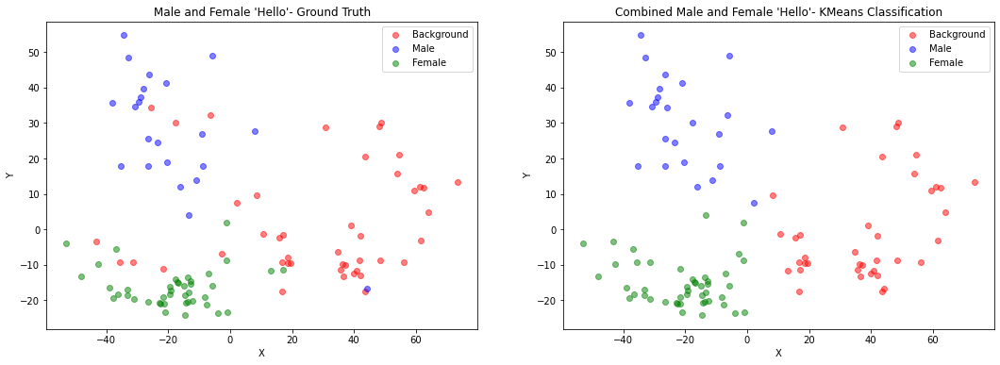

Figure 4: PCA scatter plot of distinct male and female speakers saying &ldquo;hello&rdquo;

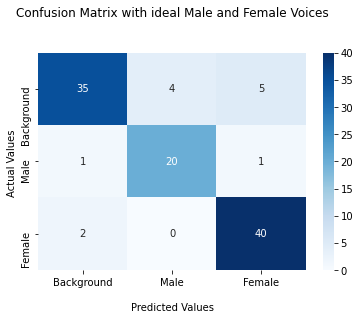

Figure 5: Confusion matrix with ideal male and female voices saying &ldquo;hello&rdquo;

&nbsp;&nbsp;&nbsp;&nbsp;&nbsp;&nbsp;&nbsp;&nbsp;In contrast, speaker identification with male-to-male audio has proven challenging using our method. The male-to-male speaker identification using our method performs worse as the clusters overlap leading to a drop in the classification accuracy. The clusters illustrated in Figure 6 show great overlap between the two male speakers. The poor prediction rate is illustrated by figure 7 as most of the predictions are not along the main diagonal.

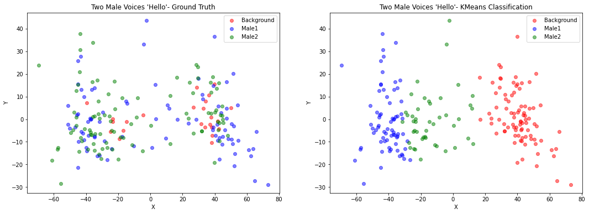

Figure 6: PCA scatter plot of two males speakers saying &ldquo;hello&rdquo;

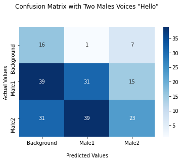

Figure 7: Confusion matrix with two male voices saying &ldquo;hello&rdquo;
<h2 class="c4" id="h.ezm7o3vumad3">4.2 Android Result</h2>
The general philosophy behind many of the Android design decisions was to mirror the functionality prototyped using Python. The Python implementation used pre-recorded audio files for extraction of audio features for classification. In order to replicate the data flow, the Android implementation used an audio buffer to store the incoming audio data from the Android Recorder API. Once the recording is finished, the design for feature extraction and classification are mapped one-to-one between the Python implementation and the C++ for Android Studio. The MFCC coefficients calculated by the Android implementation were accessible through the debugger. The coefficients calculated were saved in a text file and visualized using PCA. PCA is a library used to visualize data by reducing the dimensionality of the input data down to two or of the most significant dimensions. In our case, PCA is used to reduce the 12 dimensional MFCC coefficients down to the two most significant dimensions. Usually some differences in orientation between the PCA visualization of Python and Android can be explained away. PCA illustrates only the two dimensions it deems to be the most significant dimensions. There is no guarantee PCA will choose the same dimensions going from one dataset to another. 

&nbsp;While the Android software design was identical to the Python implementation, the results seen by Android were not. The scatter plot on the left in Figure 8 visualizes the extracted audio features with appropriate color coding to illustrate the ground truth labeling. In contrast, Figure 4 illustrates the feature extraction of the exact same audio in Python. While Figure 4 clearly demonstrated clustering of three unique clusters representing male, female, and background data, Figure 8 illustrates a single cluster with male, female, and background clusters overlaid on top of each other. Since the extracted features are lumped into one big cluster without clear cut boundaries, the KMeans classification is very poor as illustrated in the confusion matrix in Figure 9. Simply put, the labeling is wildly inaccurate in this case.&nbsp;The root cause of the discrepancy between the Python and Android implementations could be bugs in the feature extraction, discrepancy in the audio recording hardware and firmware. 

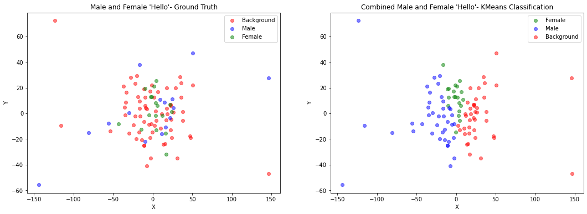

Figure 8: PCA scatter plot of distinct male and female speakers saying &ldquo;hello&rdquo; (Android)

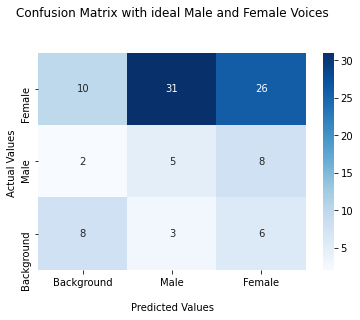

Figure 9: Confusion matrix of distinct male and female speakers saying &ldquo;hello&rdquo; (Android)

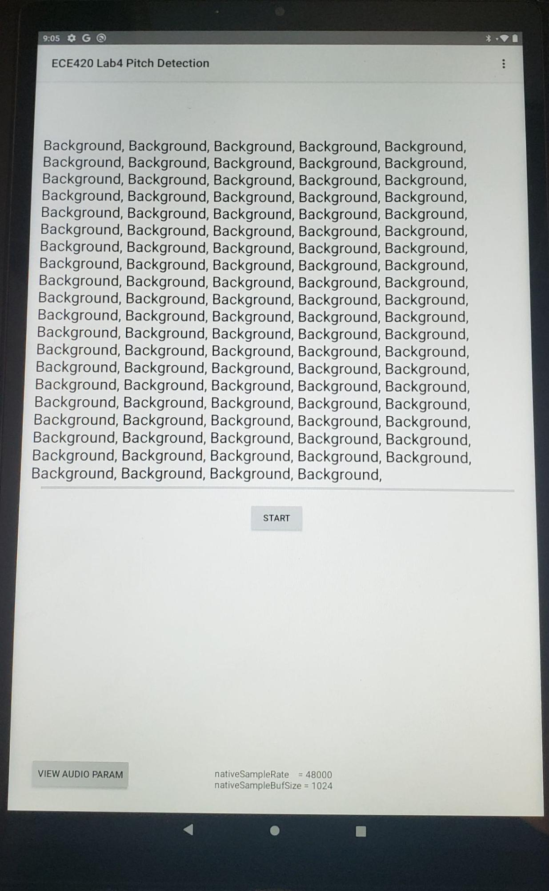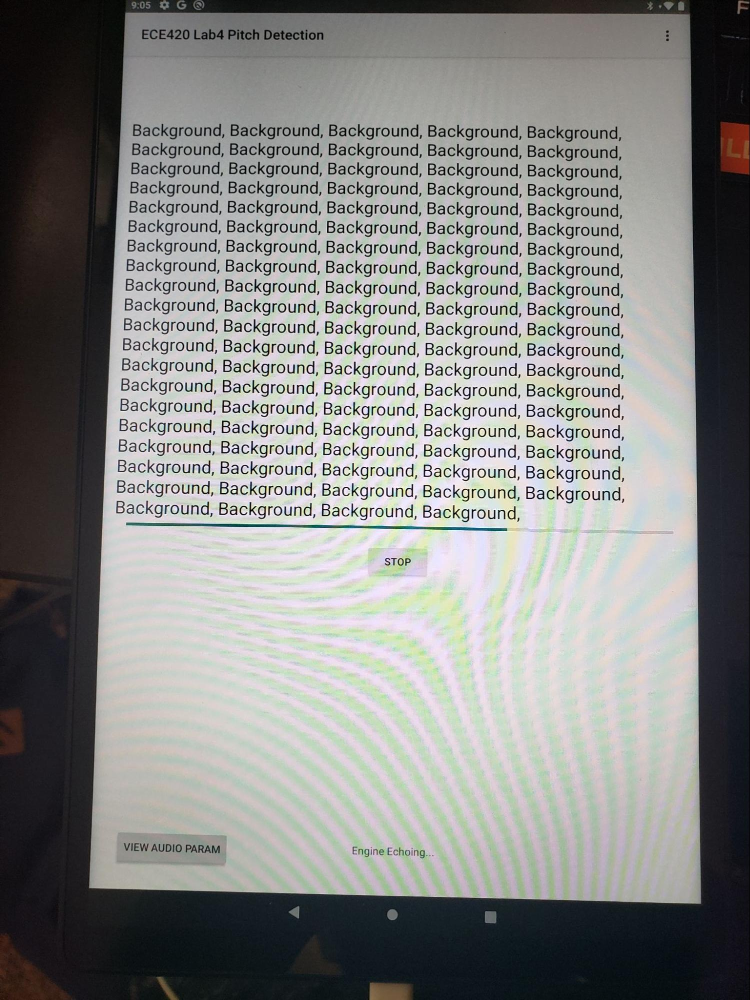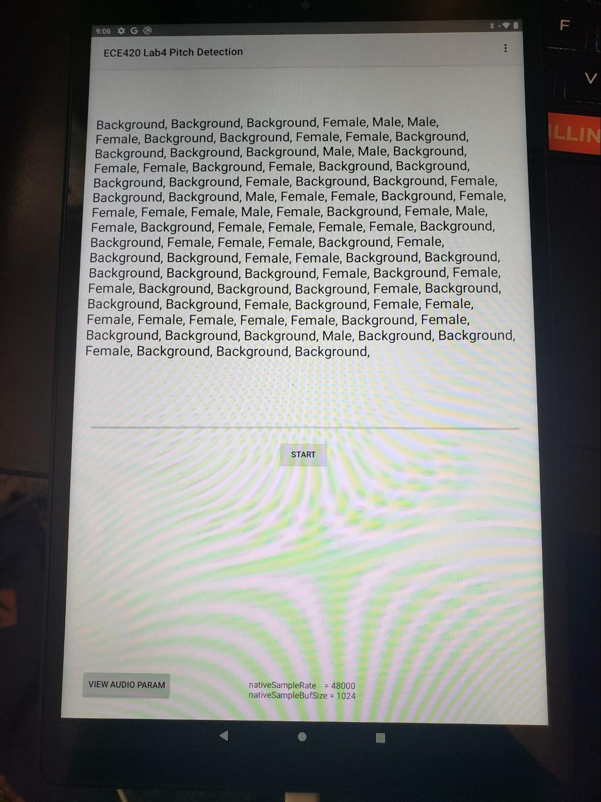

Figure 10: Android UI

<h1 class="c4" id="h.4s8ojyt4hh3r">5. Conclusion</h1><h2 class="c4" id="h.llg3jqx7hkza">5.1 &nbsp;Errata</h2>
&nbsp;&nbsp;&nbsp;&nbsp;&nbsp;&nbsp;&nbsp;&nbsp;From the Android result shown above, the program outcomes are not satisfactory and nowhere on par with the accuracy observed from the python implementation. There are largely three sources of problems that we would like to address: MFCC accuracy, noise from the hardware, and the design of the classification.

&nbsp;&nbsp;&nbsp;&nbsp;&nbsp;&nbsp;&nbsp;&nbsp;MFCC accuracy is one of the most straightforward and one of the easiest sources of the problem to nominate. From the KMeans result and functionality, it seems like the KMean classification itself does a great job of identifying the clusters. However, error in classification mainly comes from the feature classifications not being unique and distinctly represented. This clearly indicates that the feature extraction is not performing as well as the purpose of the application requires. In an effort to improve the MFCC accuracy, filtering, outlier removal, and modification of frame sizes have been implemented. Filtering and outlier removal are an effort to provide the MFCC algorithm cleaner input data. Frame size was reduced from 25ms to 20ms to have more overlapping frames, so that more sound characteristics can be captured and analyzed. As mentioned in above and also in section 4.2, various approaches to improve the MFCC performance have been attempted but none of the attempts were able to improve the performance level to the desired level. 

Related to MFCC, another potential source of an error is the noise caused by the hardware. In python implementation, the source sound file was directly fed to the software to do the data classification. However, the Android implementation has a tablet microphone hardware that serves as an input medium. Because some noises and extraordinary outliers were observable from the data, one of the guesses is that microphone noise or data losses could have distorted the input signal, which resulted in unsatisfactory performance. 

&nbsp;&nbsp;&nbsp;&nbsp;&nbsp;&nbsp;&nbsp;&nbsp;Although the classification algorithm itself didn&rsquo;t have the explicit problems, having a background noise classification may have deteriorated the accuracy significantly. Even in the python implementation, this was somewhat of an issue. In the Android implementation, background noise intruding the male and female voice cluster is very apparent.&nbsp;

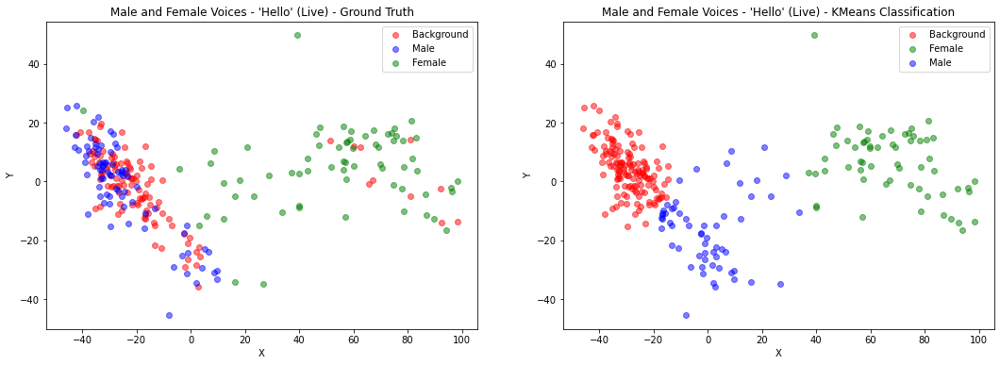

Figure 11: PCA of live recorded male and female &ldquo;Hello&rdquo;
<h2 class="c4" id="h.ahs3h2vyiel2">5.2 Suggestions</h2>
&nbsp;&nbsp;&nbsp;&nbsp;&nbsp;&nbsp;&nbsp;&nbsp;For future implementation, it is highly recommended to implement very good filtering before going through the feature extraction. Looking at how even a basic level low pass filter improves the performance as shown between Figure 12 and 13, more robust and delicate filtering may improve the performance by a significant margin. 

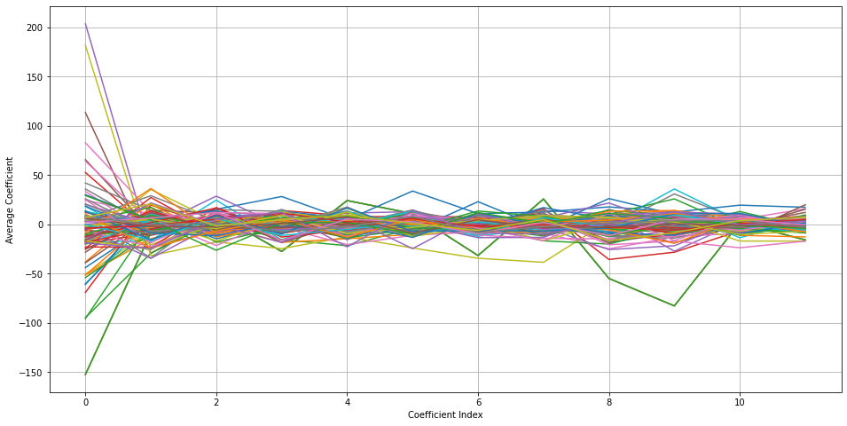

Figure 12: MFCC coefficients from male and female &ldquo;Hello&rdquo;

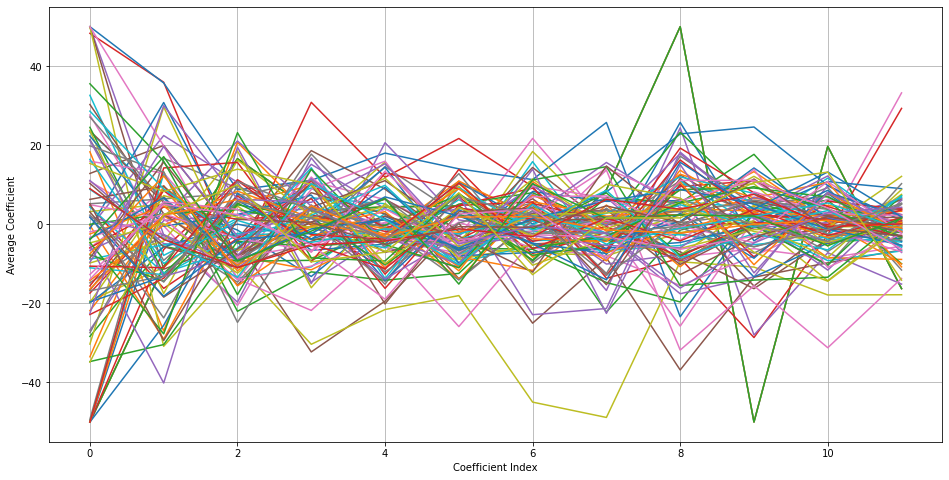

Figure 13: MFCC coefficients from male and female &ldquo;Hello&rdquo; w/ low-pass filter

&nbsp;&nbsp;&nbsp;&nbsp;&nbsp;&nbsp;&nbsp;&nbsp;Related to the filtering and also to improve the classification, GMM implementation is another factor that can improve the performance significantly. Problems mentioned above in section 5.1 include outliers and closely packed clusters. In theory, GMM can eliminate these problems because it takes the gaussian of the speech sample and tries to score the clusters based on how closely matching these samples are. If simple GMM does not resolve the issue, a variation of the GMM method that uses supervectors and SVM may be a good implementation to resolve the issue or improve the performance. Overall, all these methods try to analyze deeper into how multiple sample PDFs averages and closely match each other. It is a far more complicated and computationally expensive process than the KMeans but is a more accurate and apt classification algorithm for further development of the speaker/gender classification approach.

<h1 class="c4 c22" id="h.kzaqix9797qw"></h1><h1 class="c4" id="h.dwjfy6ex0q9o">References:</h1><ol class="c41 lst-kix_tvr8ebw12nev-0 start" start="1"><li class="c7 c46 c40 li-bullet-0">J. H. L. Hansen and T. Hasan, &quot;Speaker Recognition by Machines and Humans: A tutorial review,&quot; in IEEE Signal Processing Magazine, vol. 32, no. 6, pp. 74-99, Nov. 2015, doi: 10.1109/MSP.2015.2462851.</li></ol>
<a class="c10" href="https://www.google.com/url?q=http://home.ustc.edu.cn/~dw13/slides2016/paper2016/%255B9%255D%2520speaker%2520recognition%2520by%2520machines%2520and%2520humans_%2520a%2520tutorial%2520review.pdf?fbclid%3DIwAR2Jq_6BJew9jNNBZtuM3hxLiUNbvVpX3VoUbwoF_HBRbIv8TPGUyD4lsNU&amp;sa=D&amp;source=editors&amp;ust=1708445825605471&amp;usg=AOvVaw2P9uhAx6A1ygKVB7ogGzgq">http://home.ustc.edu.cn/~dw13/slides2016/paper2016/%5B9%5D%20speaker%20recognition%20by%20machines%20and%20humans_%20a%20tutorial%20review.pdf?fbclid=IwAR2Jq_6BJew9jNNBZtuM3hxLiUNbvVpX3VoUbwoF_HBRbIv8TPGUyD4lsNU</a>. 
<ol class="c41 lst-kix_tvr8ebw12nev-0" start="2"><li class="c7 c40 c46 li-bullet-0">Chen, Shi-Huang and Yu-Ren Luo. &ldquo;Speaker Verification Using MFCC and Support Vector Machine.&rdquo; .</li></ol>
<a class="c10" href="https://www.google.com/url?q=https://citeseerx.ist.psu.edu/viewdoc/download?doi%3D10.1.1.148.5904%26rep%3Drep1%26type%3Dpdf%26fbclid%3DIwAR2XNKnbWyUqn7yyumk7Kiloes4lZNnwKtW4hFTeZE92w-XOzJrI-H5Qrxc&amp;sa=D&amp;source=editors&amp;ust=1708445825605923&amp;usg=AOvVaw0AQLnICVKPywSvPpRX0p9u">https://citeseerx.ist.psu.edu/viewdoc/download?doi=10.1.1.148.5904&amp;rep=rep1&amp;type=pdf&amp;fbclid=IwAR2XNKnbWyUqn7yyumk7Kiloes4lZNnwKtW4hFTeZE92w-XOzJrI-H5Qrxc</a>.
<ol class="c41 lst-kix_tvr8ebw12nev-0" start="3"><li class="c45 c40 li-bullet-0">N. Jiang and T. Liu, &ldquo;An improved speech segmentation and clustering algorithm based on SOM and K-means,&rdquo; Mathematical Problems in Engineering, 12-Sep-2020. [Online]. Available: https://www.hindawi.com/journals/mpe/2020/3608286/. [Accessed: 10-Apr-2022]. </li><li class="c40 c45 li-bullet-0">K. S. Rao and M. K.E., &ldquo;Speech Recognition Using Articulatory and Excitation Source Features.&rdquo; [Online]. Available: https://link.springer.com/content/pdf/bbm%3A978-3-319-49220-9%2F1.pdf. [Accessed: 05-May-2022]. </li></ol>

<ol class="c41 lst-kix_tvr8ebw12nev-0" start="5"><li class="c46 c40 c52 li-bullet-0">&ldquo;Discrete cosine transform (algorithm and program),&rdquo; GeeksforGeeks, 20-Jan-2021. [Online]. Available: https://www.geeksforgeeks.org/discrete-cosine-transform-algorithm-program/. [Accessed: 15-Apr-2022]. </li></ol>

<h1 class="c0" id="h.nr0qrrm854x4">Appendix A: Software Documentation</h1>
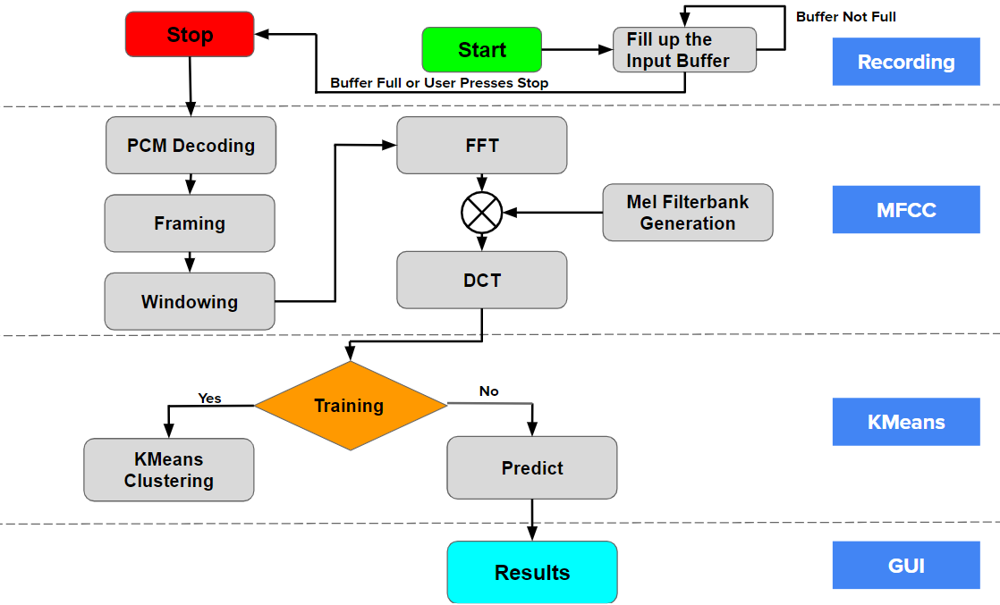

Figure 14: Software System Flow Chart of the Good Listener 
<table class="c39"><tr class="c8"><td class="c21 c48" colspan="1" rowspan="1">
Blocks:
</td><td class="c31 c48" colspan="1" rowspan="1">
Function Calls:
</td></tr><tr class="c8"><td class="c21" colspan="1" rowspan="1">
DCT
</td><td class="c31" colspan="1" rowspan="1">
dctTransform()
</td></tr><tr class="c8"><td class="c21" colspan="1" rowspan="1">
Framing and Windowing
</td><td class="c31" colspan="1" rowspan="1">
framing_windowing_power_spectrum()
</td></tr><tr class="c8"><td class="c21" colspan="1" rowspan="1">
FFT
</td><td class="c31" colspan="1" rowspan="1">
kiss_fft()
</td></tr><tr class="c8"><td class="c21" colspan="1" rowspan="1">
KMeans Clustering
</td><td class="c31" colspan="1" rowspan="1">
KMeans.fit(), KMeans.center_init_pretrainied()
</td></tr><tr class="c8"><td class="c21" colspan="1" rowspan="1">
Mel Filterbank Generation
</td><td class="c31" colspan="1" rowspan="1">
filterbank()
</td></tr><tr class="c8"><td class="c21" colspan="1" rowspan="1">
PCM Decoding 
</td><td class="c31" colspan="1" rowspan="1">
ece420ProcessFrame()
</td></tr><tr class="c8"><td class="c21" colspan="1" rowspan="1">
Predict
</td><td class="c31" colspan="1" rowspan="1">
KMeans.predict()
</td></tr></table>
Table 1: Summary of the Software System Flow Chart Function Calls

</body></html>

Android Credits: Audio-Echo
==========
The sample demos how to use OpenSL ES to create a player and recorder in Android Fast Audio Path, and connect them to loopback audio. On most android devices, there is a optimized audio path that is tuned up for low latency purpose. The sample creates player/recorder to work in this highly optimized audio path(sometimes called native audio path, [low latency path](http://stackoverflow.com/questions/14842803/low-latency-audio-playback-on-android?rq=1), or fast audio path). The application is validated against the following configurations:
  *   Android L    AndroidOne
  *   Android M    Nexus 5, Nexus 9
This sample uses the new Android Studio with CMake support, and shows how to use shared stl lib with android studio version 2.2.0, see CMakeLists.txt for details

Pre-requisites
--------------
- Android Studio 2.2+ with [NDK](https://developer.android.com/ndk/) bundle.

Getting Started
---------------
1. [Download Android Studio](http://developer.android.com/sdk/index.html)
1. Launch Android Studio.
1. Open the sample directory.
1. Open *File/Project Structure...*
  - Click *Download* or *Select NDK location*.
1. Click *Tools/Android/Sync Project with Gradle Files*.
1. Click *Run/Run 'app'*.

Usage
-----
App will capture audio from android devices and playback on the same device; the playback on speaker will be captured immediately and played back...! So to verify it, it is recommended to "mute" the playback audio with a earspeaker/earphone/earbug so it does not get looped back.  Some device like Nexus 9, once you plug in an external headphone/headspeaker, it stops to use onboard microphone AND speaker anymore -- in this case, you need turn on the microphone coming with your headphone. Another point, when switching between external headphone and internal one, the volume is sometimes very low/muted; recommend to increase the playback volume with volume buttons on the phone/pad after plugging external headphone.

Low Latency Verification
------------------------

1. execute "adb shell dumpsys media.audio_flinger". Find a list of the running processes

   Name Active Client Type      Fmt Chn mask Session fCount S F SRate  L dB  R dB    Server Main buf  Aux Buf Flags UndFrmCnt  
   F  2     no    704    1 00000001 00000003     562  13248 S 1 48000  -inf  -inf  000033C0 0xabab8480 0x0 0x600         0  
   F  6    yes   9345    3 00000001 00000001     576    128 A 1 48000     0     0  0376AA00 0xabab8480 0x0 0x400       256 

1. execute adb shell ps  | grep echo  

  * find the sample app pid  
  * check with result on step 1.  
   if there is one "F" in the front of your echo pid, **player** is on fast audio path  
   For fast audio capture [it is totally different story], if you do **NOT** see  
   com.example.nativeaudio W/AudioRecord﹕ AUDIO_INPUT_FLAG_FAST denied by client  
in your logcat output when you are creating audio recorder, you could "assume" you are on the fast path.  
If your system image was built with muted ALOGW, you will not be able to see the above warning message.

Tune-ups
--------
A couple of knobs in the code for lower latency purpose:
  * audio buffer size
  * number of audio buffers cached before kicking start player
The lower you go with them, the lower latency you get and also the lower budget for audio processing. All audio processing has to be completed in the time period they are captured / played back, plus extra time needed for:
  * audio driver
  * audio flinger framework,
  * bufferqueue callbacks etc
Besides those, the irregularity of the buffer queue player/capture callback time is another factor. The callback from openSL may not as regular as you assumed, the more irregularity it is, the more likely have choopy audio. To fight that, more buffering is needed, which defeats the low-latency purpose! The low latency path is highly tuned up so you have better chance to get more regular callbacks. You may experiment with your platform to find the best parameters for lower latency and continuously playback audio experience.
The app capture and playback on the same device [most of times the same chip], capture and playback clocks are assumed synchronized naturally [so we are not dealing with it]

Credits
-------
  * The sample is greatly inspired by native-audio sample
  * Don Turner @ Google for the helping of low latency path
  * Ian Ni-Lewis @ Google for producer/consumer queue and many others

Support
-------
If you've found an error in these samples, please [file an issue](https://github.com/googlesamples/android-ndk/issues/new).

Patches are encouraged, and may be submitted by [forking this project](https://github.com/googlesamples/android-ndk/fork) and
submitting a pull request through GitHub. Please see [CONTRIBUTING.md](../CONTRIBUTING.md) for more details.

- [Stack Overflow](http://stackoverflow.com/questions/tagged/android-ndk)
- [Google+ Community](https://plus.google.com/communities/105153134372062985968)
- [Android Tools Feedbacks](http://tools.android.com/feedback)

License
-------
Copyright 2015 Google, Inc.

Licensed to the Apache Software Foundation (ASF) under one or more contributor
license agreements.  See the NOTICE file distributed with this work for
additional information regarding copyright ownership.  The ASF licenses this
file to you under the Apache License, Version 2.0 (the "License"); you may not
use this file except in compliance with the License.  You may obtain a copy of
the License at

http://www.apache.org/licenses/LICENSE-2.0

Unless required by applicable law or agreed to in writing, software
distributed under the License is distributed on an "AS IS" BASIS, WITHOUT
WARRANTIES OR CONDITIONS OF ANY KIND, either express or implied.  See the
License for the specific language governing permissions and limitations under
the License.
